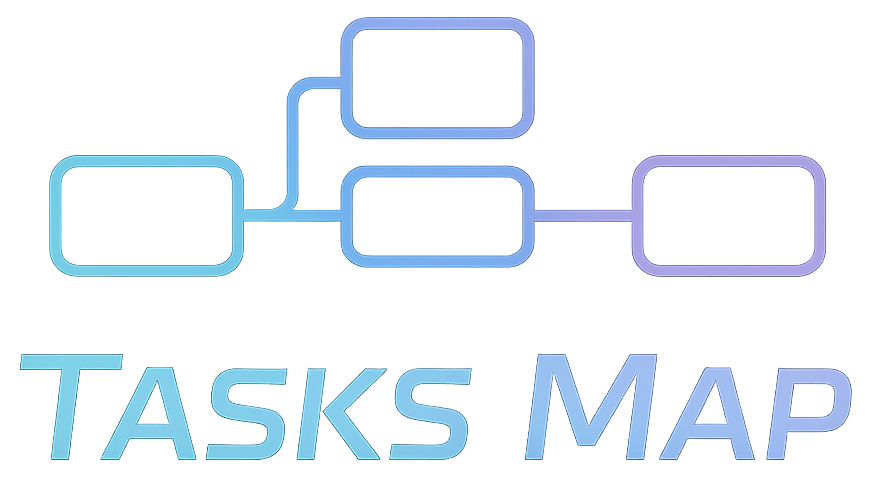
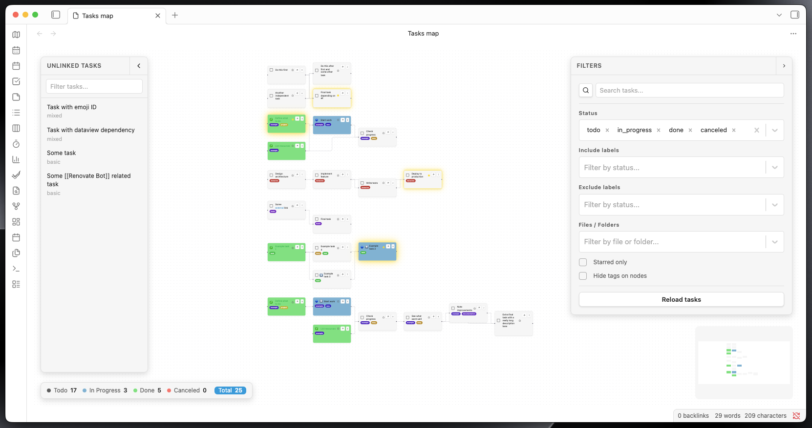

  

	
	
	

---

**Tasks Map** is a minimal Obsidian plugin that visualizes your tasks as an interactive graph. It supports both **inline checkbox tasks** (`- [ ] task text`) via Dataview and **file-based tasks** (NoteTask) where an entire note becomes a task through frontmatter metadata. Each task is represented as a node, with edges showing relationships based on special emoji/link syntax.

### Highlights

- 📊 **Graph Visualization** — See all your tasks as draggable nodes in a React Flow graph
- 📝 **Dual Task Sources** — Supports inline `- [ ]` checkbox tasks and file-based NoteTask notes (frontmatter with `tags: [task]`)
- 🔗 **Task Relationships** — Edges based on 🆔 / ⛔ emoji/link syntax (inline) or `blockedBy` / `dependsOn` frontmatter (NoteTask)
- 🏷️ **Tag Filtering** — Focus your view with multi-select tag filtering
- ✅ **Task Completion** — Mark tasks done/undone directly from the graph
- 🌍 **Internationalization** — English, Dutch, Simplified Chinese

### Quick Start

**Required:** [Dataview](https://github.com/blacksmithgu/obsidian-dataview) and [Tasks](https://github.com/obsidian-tasks-group/obsidian-tasks) plugins must be installed and enabled.

Install through the Obsidian plugin manager: https://obsidian.md/plugins?id=tasks-map

### 📖 Documentation

Full documentation is available at **[nicoknl.github.io/tasks-map](https://nicoknl.github.io/tasks-map/)**.
