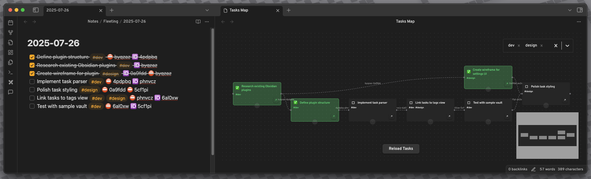
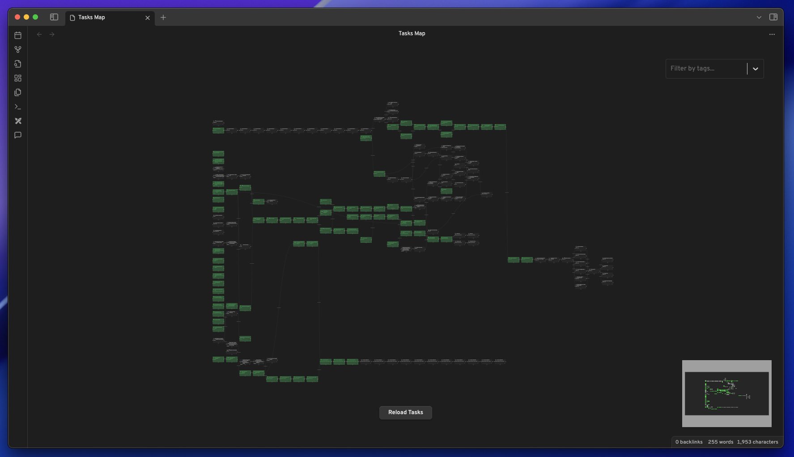

<p align="center">
  
</p>
<p align="center">

	
	
	
</p>

---

**Tasks Map** is a minimal Obsidian plugin that visualizes your `- [ ] tasks` as an interactive graph. Each task is represented as a node, with edges showing relationships based on special emoji/link syntax in your task text as implemented in the popular Tasks plugin.

## Pre-requisites

- **Required:** You must have both the [Dataview](https://github.com/blacksmithgu/obsidian-dataview) plugin and the [Tasks](https://github.com/obsidian-tasks-group/obsidian-tasks) plugin installed and enabled in your vault.

## Features

- **Graph Visualization:** See all your Dataview tasks as draggable nodes in a React Flow graph.
- **Custom Nodes:** Each node displays task summary, tags, priority emoji, and completion status (color-coded).
- **Task Relationships:** Edges are created based on special emoji/link syntax (🆔 for outgoing, ⛔ for incoming, with hashes).
- **Edge Management:** Select and delete edges (removes the hash from both tasks/files).
- **Tag Filtering:** Filter visible tasks by tag using a multi-select dropdown overlay.
- **Quick Navigation:** Open the linked file for any task directly from the node.
- **Task Completion:** Mark tasks as completed/incomplete directly from the graph.
- **UI Overlays:** Modern overlays for tag filtering and reloading tasks.
- **Priority & Emoji Support:** Priority emoji (🔺, ⏫, 🔼, 🔽, ⏬) and robust emoji rendering.
- **Automatic Layout:** Uses dagre for clean, readable graph layouts.
- **Internationalization:** Support for multiple languages (English, Dutch, Simplified Chinese) with easy language switching in settings.

### Examples





## Installation

Install through the Obsidian plugin manager: https://obsidian.md/plugins?id=tasks-map

### Local installation

1. **Clone or Download:** Place the plugin folder in your vault's `.obsidian/plugins/tasks-map/` directory.
2. **Install Dependencies:**
   ```sh
   npm install
   ```
3. **Build the Plugin:**
   ```sh
   npm run build
   ```
4. **Enable in Obsidian:**
   - Open Obsidian settings → Community plugins → Enable "Tasks Map".

## Usage

- Open the "Tasks Map" view from the ribbon or command palette.
- Drag nodes to rearrange tasks visually.
- Click the checkmark to mark a task as completed/incomplete.
- Click the link icon to open the task's file.
- Select and delete edges to remove task relationships.
- Use the tag filter overlay to focus your view.

## Development

- **Dev Mode:**
  ```sh
  npm run dev
  ```
- **Build:**
  ```sh
  npm run build
  ```
- **Lint:**
  ```sh
  npm run lint
  ```

## Contributing

Pull requests and suggestions are welcome! Please open an issue or PR on GitHub.

## License

MIT

## API Documentation

See [Obsidian API Docs](https://github.com/obsidianmd/obsidian-api)
